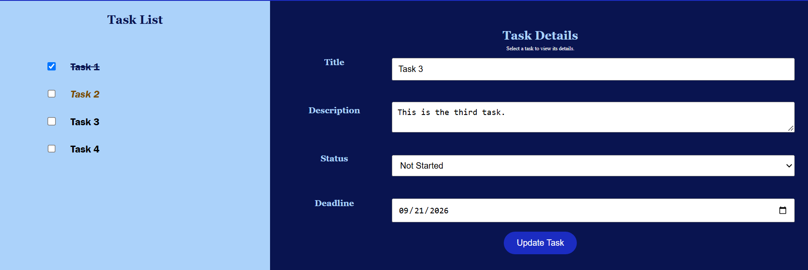
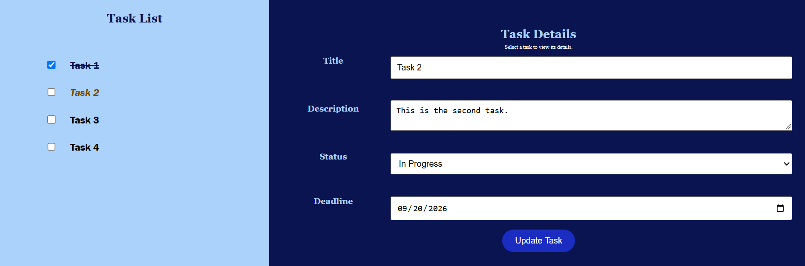

# Tugas2-PWeb
Tugas 2 Week 3 Matkul Pemrograman Web

## Name: Muhammad Ludaka Firdaus

## NRP: 5025251102

## Web Description:
My current webpage is the continuation from the previous task. The main different is my webpage now not entirely hardcoded. The user can change the task details including deadline, title, status, and notes. Beside that, the user can also add many new tasks. The new task that is entered will automatically have a 'not-started' status. To view the task details, the user can click the text of the task that show a pointer cursor if the user move the cursor to the text area. There's some minor change about the responsive. I've made the current web more responsive by changing the CSS unit from px to the more dynamic unit like vh, so it will be more accessible from many more devices.

## Preview:

* Change 1 (Status: Not started)

Note: If the task status is not started, it is normal font
* Change 2 (Status: In Progress)

Note: If the task status is in progress, the font will be italic and color is changed to yellow/orange
* Change 3 (Status: Completed)

Note: If the task status is completed, the color will be black and the text will be stripped

* Task Additional

<video width="1000" height="500" controls>
  <source src="assets/add-task.mp4" type="video/mp4">
</video>

