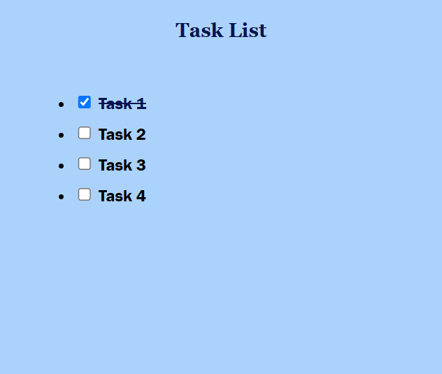
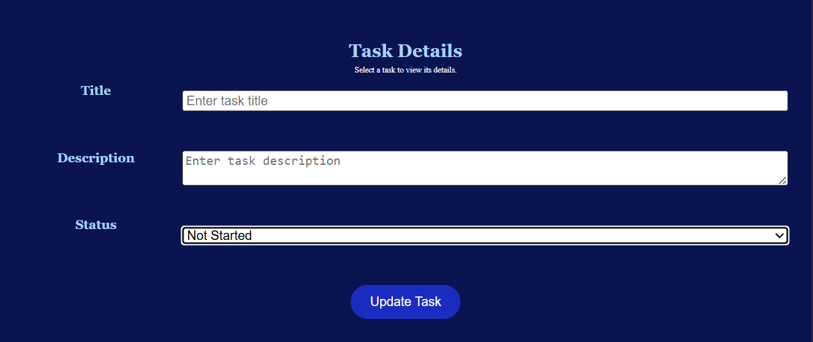
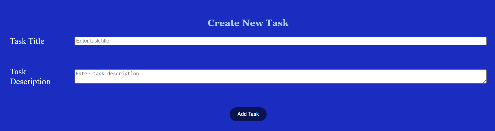

# Tugas1-PWeb
Tugas 1 Week 2 Matkul Pemrograman Web

## Name: Muhammad Ludaka Firdaus

## NRP: 5025251102

## Web Description:
My 1 webpage contains 5 parts. The first part is the header for the title 'Welcome to my To-Do List App'. The second part is for the Task List, where the List of my Tasks whether done or not, will be written there (checked box and stripped text for finished task). The third part is Task Details where we can change every task listed in the Task List, from the title, description, and status. Under the second and third part, there is the forth task, which is Form to create a new task, every new task that is entered will be added to the second part with the 'Not Started' status. The last part is footer, that contains my GitHub Link profile and the copyright.

## Preview:

* Header: 

* Task List: 

* Task Details: 

* Task Form: 

* Footer: 

